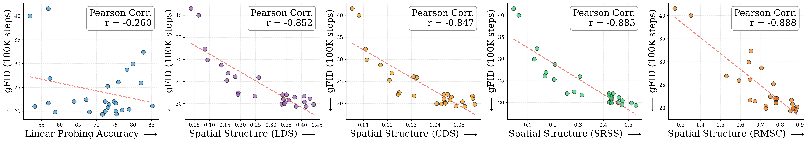
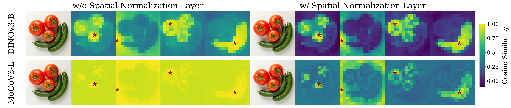

## What Matters for Representation Alignment: Global Information or Spatial Structure?<br><sub>Official PyTorch Implementation: Improved REPA in just 3 lines of code</sub>

### [Paper](https://arxiv.org/abs/2512.10794) | [Project Page](https://end2end-diffusion.github.io/irepa/)


> [**What Matters for Representation Alignment: Global Information or Spatial Structure?**](#)<br>
> [Jaskirat Singh<sup>1,*</sup>](https://1jsingh.github.io/), [Xingjian Leng<sup>2</sup>](https://xingjianleng.github.io/), [Zongze Wu<sup>1</sup>](https://betterze.github.io/website/), [Liang Zheng<sup>2</sup>](https://zheng-lab.cecs.anu.edu.au/), [Richard Zhang<sup>1</sup>](https://scholar.google.com/citations?user=LW8ze_UAAAAJ&hl=en), <br>[Eli Shechtman<sup>1</sup>](https://scholar.google.com/citations?user=B_FTboQAAAAJ), [Saining Xie<sup>3</sup>](https://www.sainingxie.com/)
> <br><sup>1</sup>Adobe Research, <sup>2</sup>ANU, <sup>3</sup>New York University<br>
<!-- > <sup>*</sup>Work done during internship at Adobe Research<br> -->

Representation matters for generation. But what truly drives its effectiveness: global semantic information or spatial structure? Prevailing wisdom says global semantics. **We reveal a surprising finding: spatial structure, not global semantic information, drives generation performance of a representation.**

Building on this finding, we introduce iREPA, a simple three lines of code change which consistently improves convergence speed with REPA across diverse training recipes (REPA, REPA-E, Meanflow, JiT etc).

**iREPA: Improved REPA in just 3 lines of code**
```python
# 1. Conv projection instead of MLP
proj_layer = nn.Conv2d(D_in, D_out, kernel_size=3, padding=1)

# 2. Spatial normalization on encoder features [B, T, D]
x = x - gamma * x.mean(dim=1, keepdim=True)
x = x / (x.std(dim=1, keepdim=True) + 1e-6)
```

<!-- **Key Finding**: Spatial structure, not ImageNet-1K accuracy, determines generation performance in representation alignment. -->

## Dependency Setup

```bash
git clone https://github.com/End2End-Diffusion/iREPA.git
cd iREPA

# Create environment (Python 3.10+)
conda create -n irepa python=3.10 -y && conda activate irepa

# Install dependencies
pip install -r environment/requirements.txt
```

## Data
- **Option A – Quick Start (Recommended)**: Download the full pre-processed dataset:
  ```bash
  hf download REPA-E/iREPA-collections \
    --include "data/**" \
    --local-dir "."
  ```
- **Option B – Bring Your Own ImageNet**: Ensure your data resides at `data/imagenet/` and contains `train/` and `val/` subfolders. Then, download only the cached latents:
  ```bash
  hf download REPA-E/iREPA-collections \
    --include "data/imagenet-latents-sdvae-ft-mse-f8d4/**" \
    --local-dir "."
  ```

## Pretrained Vision Encoder

Download pre-trained vision encoders and install the DINOv3 dependency.
```bash
# Step 1: Download pre-trained vision encoders
hf download REPA-E/iREPA-collections \
  --include "pretrained_models/**" \
  --local-dir "."

# Step 2: Clone DINOv3 repository
git clone https://github.com/facebookresearch/dinov3.git
cd dinov3
git checkout 94a96ac83c2446f15f9bdcfae23cad3c6a9d4988
cd ..
```

## Training

This repository provides REPA/iREPA for both latent and pixel-space diffusion:

| Approach | Description | Directory |
|----------|-------------|-----------|
| **LDM** | Latent Diffusion (SiT) | [`ldm/`](ldm/) |
| **JiT** | Pixel-space diffusion (JiT) | [`jit/`](jit/) |

**Note**: We provide all model checkpoints with REPA and iREPA across all vision encoders: [here](https://huggingface.co/REPA-E/iREPA-collections/tree/main/exps_irepa_400k). 

### LDM (Latent Diffusion)

* SiT + REPA (using `pe-vit-g` encoder)
```bash
cd ldm

accelerate launch train.py --config configs/repa.yaml \
  --model="SiT-B/2" \
  --enc-type="pe-vit-g" \
  --encoder-depth=4 \
  --data-dir=../data \
  --exp-name="sitb2-pe-vit-g-repa"
```

* SiT + iREPA (using `pe-vit-g` encoder)
```bash
cd ldm

accelerate launch train.py --config configs/irepa.yaml \
  --model="SiT-B/2" \
  --enc-type="pe-vit-g" \
  --encoder-depth=4 \
  --data-dir=../data \
  --exp-name="sitb2-pe-vit-g-irepa"
```

### JiT (Pixel-Space)

* JiT + REPA (using `pe-vit-g` encoder)
```bash
cd jit

torchrun --nproc_per_node=4 main_jit.py --config configs/irepa.yaml \
  --model JiT-B/16 \
  --enc_type="pe-vit-g" \
  --encoder_depth=4 \
  --data_path=../data \
  --output_dir="exps/jit-pe-vit-g-repa"
```

* JiT + iREPA (using `pe-vit-g` encoder)
```bash
cd jit

torchrun --nproc_per_node=4 main_jit.py --config configs/irepa.yaml \
  --model JiT-B/16 \
  --enc_type="pe-vit-g" \
  --encoder_depth=4 \
  --data_path=../data \
  --output_dir="exps/jit-pe-vit-g-irepa"
```

## Evaluation

### Generate Samples

**LDM:**
```bash
cd ldm
torchrun --nproc_per_node=8 generate.py \
  --model="SiT-B/2" \
  --ckpt="exps/<exp_name>/checkpoints/<step>.pt" \
  --num-fid-samples=50000 \
  --sample-dir=samples
```

**JiT:** Online evaluation is enabled by default with `--online_eval`.

### Compute FID/IS

We use the [ADM evaluation suite](https://github.com/openai/guided-diffusion/tree/main/evaluations) to compute image generation quality metrics, including gFID, sFID, Inception Score (IS), Precision, and Recall.

## Spatial Metrics and Visualization

We provide spatial metrics (LDS, CDS, SRSS, RMSC) for evaluating vision encoder feature representations. 
**Download pre-computed features and stats:**
```bash
cd metrics
# Download spatial metrics data (~20GB)
huggingface-cli download REPA-E/iREPA-collections \
  --include "spatial-metrics-data/**" \
  --local-dir "." \
  --repo-type model
mv spatial-metrics-data data
```

**Plot correlation with FID across all vision encoders (Linear Probing vs Spatial Metrics):**
```bash
cd metrics
python spatial_metrics_comparison.py --device cuda
```


**Visualize spatial normalization effects across different encoders:**
```bash
python scripts/viz_spatialnorm.py \
    --encoders dinov3-vit-b16 mocov3-vit-l \
    --device cuda \
    --image_path assets/image1.png \
    --seed 0 \
    --output_dir assets \
    --output_index 1
```


## Supported Encoders

- **DINOv1**: `dino-vit-b`
- **DINOv2**: `dinov2-vit-b`, `dinov2-vit-l`, `dinov2-vit-g`
- **DINOv3**: `dinov3-vit-b16`, `dinov3-vit-l16`, `dinov3-vit-h16plus`, `dinov3-vit-7b16`
- **WebSSL**: `webssl-vit-dino300m_full2b_224`, `webssl-vit-dino1b_full2b_224`, `webssl-vit-dino2b_full2b_224`, `webssl-vit-dino3b_full2b_224`, `webssl-vit-dino5b_full2b_224`, `webssl-vit-dino7b_full8b_224`
- **MoCoV3**: `mocov3-vit-b`, `mocov3-vit-l`
- **CLIP**: `clip-vit-L`
- **I-JEPA**: `jepa-vit-h`
- **MAE**: `mae-vit-l`
- **SigLIP**: `siglip-vit-b`, `siglip-vit-l`, `siglip-vit-so400m`
- **SigLIP2**: `siglip2-vit-b`, `siglip2-vit-l`, `siglip2-vit-so400m`, `siglip2-vit-g`
- **PE**: `pe-vit-b`, `pe-vit-l`, `pe-vit-g`
- **LangPE**: `langpe-vit-l`, `langpe-vit-g`
- **SpatialPE**: `spatialpe-vit-b`, `spatialpe-vit-l`, `spatialpe-vit-g`
- **SAM2**: `sam2-vit-s`, `sam2-vit-b`, `sam2-vit-l`

## Acknowledgments

The codebase is built upon some amazing projects:
- [REPA](https://github.com/sihyun-yu/REPA)
- [REPA-E](https://github.com/End2End-Diffusion/REPA-E)
- [JiT](https://github.com/LTH14/JiT)

We thank the authors for making their work publicly available!

## BibTeX

```bibtex
@article{singh2025matters,
  title={What matters for Representation Alignment: Global Information or Spatial Structure?},
  author={Singh, Jaskirat and Leng, Xingjian and Wu, Zongze and Zheng, Liang and Zhang, Richard and Shechtman, Eli and Xie, Saining},
  journal={arXiv preprint arXiv:2512.10794},
  year={2025}
}
```
